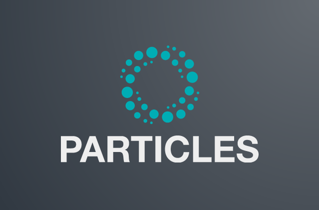

# particles #

Sequential Monte Carlo in python. 



## Motivation ##

This package was developed to complement the following book:

[An introduction to Sequential Monte Carlo](https://www.springer.com/gp/book/9783030478445)

by Nicolas Chopin and Omiros Papaspiliopoulos. 

It now also implements algorithms and methods introduced after the book was
published, see below. 

## Features ##

* **particle filtering**: bootstrap filter, guided filter, APF.

* **resampling**: multinomial, residual, stratified, systematic and SSP. 

* possibility to define **state-space models** using some (basic) form of 
  probabilistic programming; see below for an example. 

* **SQMC** (Sequential quasi Monte Carlo);  routines for computing the Hilbert curve, 
  and generating RQMC sequences. 

* **FFBS (forward filtering backward sampling)**: standard, O(N^2) variant, and
  faster variants based on either MCMC, pure rejection, or the hybrid scheme;
  see Dau & Chopin (2022) for a discussion. The QMC version of Gerber and
  Chopin (2017, Bernoulli) is also implemented.

* **other smoothing algorithms**: fixed-lag smoothing, on-line smoothing,
  two-filter smoothing (O(N) and O(N^2) variants).  

* Exact filtering/smoothing algorithms: **Kalman** (for linear Gaussian models) 
  and **forward-backward recursions** (for finite hidden Markov models).

* **Standard and waste-free SMC samplers**: SMC tempering, IBIS (a.k.a. data
  tempering). SMC samplers for binary words (Schäfer and Chopin, 2014), with
  application to **variable selection**.

* Bayesian parameter inference for state-space models: **PMCMC** (PMMH, Particle Gibbs) 
  and **SMC^2**. 

* Basic support for **parallel computation** (i.e. running multiple SMC algorithms 
  on different CPU cores). 

* **Variance estimators** (Chan and Lai, 2013 ; Lee and Whiteley, 2018; Olsson
  and Douc, 2019).

* **nested sampling**: both the vanilla version and the SMC sampler of Salomone
  et al (2018).

## Example ##

Here is how you may define a parametric state-space model: 

```python
import particles
import particles.state_space_models as ssm
import particles.distributions as dists

class ToySSM(ssm.StateSpaceModel):
    def PX0(self):  # Distribution of X_0 
        return dists.Normal()  # X_0 ~ N(0, 1)
    def PX(self, t, xp):  # Distribution of X_t given X_{t-1}
        return dists.Normal(loc=xp)  # X_t ~ N( X_{t-1}, 1)
    def PY(self, t, xp, x):  # Distribution of Y_t given X_t (and X_{t-1}) 
        return dists.Normal(loc=x, scale=self.sigma)  # Y_t ~ N(X_t, sigma^2)
```

You may now choose a particular model within this class, and simulate data from it:

```python
my_model = ToySSM(sigma=0.2)
x, y = my_model.simulate(200)  # sample size is 200
```

To run a bootstrap particle filter for this model and data `y`, simply do:

```python
alg = particles.SMC(fk=ssm.Bootstrap(ssm=my_model, data=y), N=200)
alg.run()
```

That's it! Head to the
[documentation](https://particles-sequential-monte-carlo-in-python.readthedocs.io/en/latest/) 
for more examples, explanations, and installation instructions. 

## Who do I talk to? ##

Nicolas Chopin (nicolas.chopin@ensae.fr) is the main author, contributor, and 
person to blame if things do not work as expected. 

Bug reports, feature requests, questions, rants, etc are welcome, preferably 
on the github page. 
